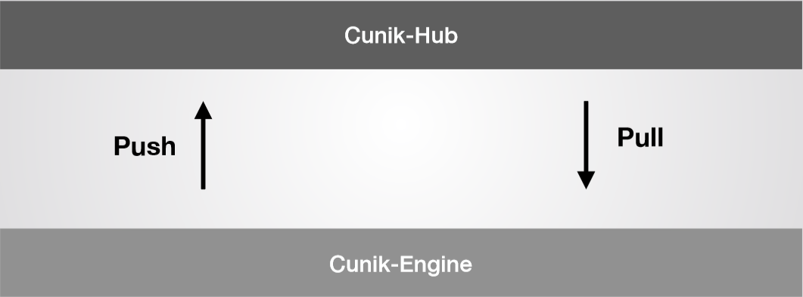
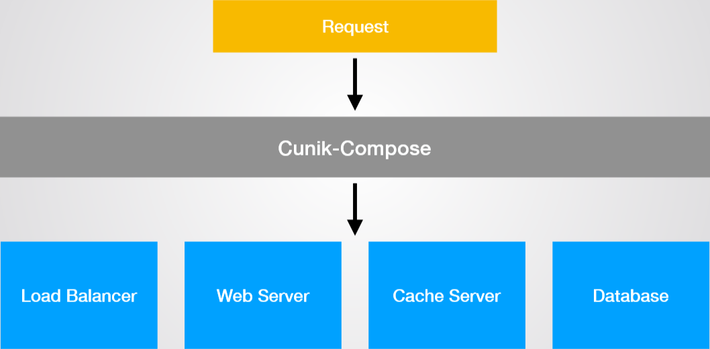

# 项目介绍

Cunik 是我们组设计并初步实现的一个面向开发人员和系统管理人员的平台，用于方便地构建、分发、运行、管理 Unikernel 应用。Cunik 的设计目标是克服 Unikernel 配置难、部署繁琐的缺点，同时发挥 Unikernel 隔离性好、性能优良的特点，使运维人员轻松地获益于 Unikernel 这一新兴的技术。

# 立项依据

在现今这个信息技术飞速发展的时代，云服务的重要性日渐显露，可提供云服务的的传统虚拟化技术优点与缺点并存。应运而生的容器技术，例如 Docker 技术发展迅速。Docker 生态具有一致的运行环境，可持续交付和部署，能够轻松地迁移、维护和扩展，大大提高了工作效率，但依然受限于各种不可突破的性能瓶颈。

而 Unikernel 在保持了原有的安全性、隔离性、易部署性的前提下，还做到了在启动速度、运行速度、内存开销等方面全面胜过 Docker。Unikernel 可以在不同的硬件平台上用不同的方法实现不同的应用程序，现在 Unikernel 正运行在世界各地的研究实验室、服务器机房以及各种低功耗设备上。

综合 Unikernel 和 Docker 的优点，我们提出了 Cunik。

融合 Docker 将应用容器化的思想，Cunik 向用户隐藏繁琐的细节，使用户可以轻松地构建、分发、获取和配置 Unikernel  应用，降低开发、部署和运维成本，并可以克服 Unikernel 开发难度高、分发部署困难、对系统管理人员要求高、对现有云计算架构改动大的缺点。

借助 Unikernel 的优势，Cunik 可以使用户轻松获得显著的性能提升和更高的安全性、减小攻击面、降低资源占用，助力云计算发展。

# 项目架构

## 总体设计

在我们的构想中，Cunik 的整体布局应该如下图所示：

 

目前 Cunik 项目主要由两个部分组成：

- Cunik-engine
- Cunik-cli

在 Cunik 项目的后续工作中，我们还将加入其他部分：

- Cunik-Hub
- Cunik-Compose

## Cunik-engine

Cunik-engine 是 Cunik 项目的核心部分，我们通过 Cunik-engine 处理来自用户的各类请求并运行相应 Unikernel 应用或对 Unikernel 应用做某些操作。

### Cunik-engine 构成

#### Cunik API

Cunik API 中封装了目前 Cunik-engine 所支持的操作的接口，用户可以通过调用这些接口来方便地使用 Cunik-engine 并操作相应的 Unikernel 应用。

#### Cunik Models

在 Cunik Models 部分，Cunik-engine 会根据 API 产生一个 Cunik Config，并避免和已有的 Cunik Objects 发生冲突。

如果用户正在启动一个新的 Cunik 应用，那么会根据 Cunik Config 生成一个 Cunik Object，并将其加入到 Cunik registry 中。

如果对已经存在 Cunik 实例进行操作，目前只能改变其运行状态。

#### Unikernel Backends

Unikernel 有多种实现方式，每种实现方式都有其不同的特点，目前主流的实现方式有 Rumpkernel、OSv、includeOS 等。不同的 Unikernel 实现方式注重 Unikernel 方法的不同方面，例如 MirageOS 专注于安全性，ClickOS 注重速度，而 OSv 则注重与老式软件的兼容。因此，选择合适的 Unikernel 实现方式至关重要。

Unikernel Backends 部分将会为不同的 Cunik Objects 选择合适的 Unikernel 后端，即合适的实现方式。 

鉴于不同的 Unikernel 实现方式其架构不同，例如 Rumpkernel 由 Kernel+Rootfs+Cmdline 的方式实现，而 OSv 则将 Kernel、Rootfs、Cmdline 融合在一起，Unikernel Backends 部分并非简单的选择 Unikernel 实现方式，而是在其基础上做了一些改进以提升易用性。 

目前我们的 Cunik-engine 实现了对 Rumpkernel、OSv 的支持，并能在日后便捷地加入对 includeOS、MirageOS 等实现方式的支持。

#### VM Backends

选择好合适的 Unikernel 实现方式后，会在 Image Registry 中查询该应用的 Image，然后通过 VM Backends 部分生成 VM Config，不同的 Unikernel 后端产生的 VM Config 是不同的，它将用于启动虚拟机。

#### VM Hypervisor

VM Hypervisor 会接收 VM Backends 生成的 VM Config，然后选择合适的虚拟机来运行 Unikernel 应用。

由于 libvert 提供了虚拟机管理工具，我们选择了使用 libvert 来完成这一任务。

目前实现了对 KVM、QEMU 的支持，并将在日后实现对 Xen 等其他虚拟机的支持。

### Cunik-engine 运行流程

- 用户通过调用 Cunik API 中的 `Creat`、`Run`、`Stop`、`Remove`、`Inspect` 等 API 接口命令来启动 Cunik-engine。
- Cunik-engine 在接受到命令后，首先会生成一个 Cunik Config，用于生成 Cunik Object。
- 通过Cunik Models，engine 会生成 Cunik Object，并加入到 Cunik Registry 中，或对已有 Cunik Object 进行运行状态的修改。
- 然后，Unikernel Backends 会根据不同的 Cunik Object 选择不同的 Unikernel 实现方式。
- 接下来，根据所选择的 Unikernel 实现方式，并在 Image Regsitry 中查询 Unikernel 应用的 image ，然后由 VM Backends 生成 VM Config。
- VM Hypervisor 接收 VM Config 并选择合适的虚拟机来运行这个 Unikernel 应用。

## Cunik-cli

Cunik 项目为 Cunik-engine 配置了命令行界面，支持 `list`、`stop`、`remove`、`creat`、`help`、`info`、`strat` 等命令，用于便捷地操作 Cunik-engine。

# 过程回顾

项目的完成主要经过了两个过程：

- 项目构思与相关知识积累；
- 具体实现及代码编写。

## 项目构思与相关知识积累

### 构思 Cunik 项目的架构

在先期对 Unikernel 技术和 Docker 技术调研的基础上，小组成员们研究了 Docker 的构架以及各类现有 Unikernel 项目。在此基础上，提出了基于 Cunik-engine、Cunik-cli，并拓展出 Cunik-Hub 和 Cunik-Compose 的 Cunik 项目总体架构，并细化了 Cunik-engine、Cunik-cli 的实现方式。

### 学习 Rumprun 和 OSv 两种 Unikernel 实现的使用方法

由于各类 Unikernel 实现拥有不同的优点和实现方式，在调研了各类 Unikernel 实现方法并经过充分的讨论后，项目小组决定先实现对 Rumprun 和 OSv 两种 Unikernel 实现的支持。

因此，小组成员首先学习了 Rumprun 和 OSv 的使用方法，并在各自的 PC 上运行了一些 Unikernel 应用。

### 学习使用 libvirt 管理虚拟机

鉴于 libvert 提供了便捷且功能强大的虚拟机管理工具，项目小组决定基于 libvert 构建 Cunik-engine 的 VM Backends 和 VM Hypervisor 部分。

因此，小组成员学习了 libvert 的相关知识，阅读了相关代码，并各自使用了 libvert。

## 具体实现及代码编写

在具体实现过程中，我们采用融合了模块化的自底向上的开发方法来完成代码的编写。

### 封装 libvirt 提供的接口，作为我们的虚拟机后端

libvert 提供了一些管理虚拟机的接口，但要融入到 Cunik 项目中，需要对其进行一些改进和封装。项目小组首先完成了这部分工作，以定义出属于 Cunik 项目的接口，方便后续的开发。

### 编写 Rumprun、OSv 后端

考虑到日后会加入对更多 Unikernel 实现方式的支持，以及 Rumprun 和 OSv 具有不同的实现方式，因此并不能简单地将它们移植到 Cunik-engine 中。项目小组根据 Rumprun 和 OSv 的特性进行改进，编写了对应的后端，以融入到项目之中，并为日后的扩展留有余地。

### 编写路由功能，完成 Cunik-engine

我们希望 Cunik 能够实现对网络请求的支持，因此加入了根据网络请求，调用对应操作函数的路由功能，进一步完善 Cunik-engine。

### 编写 Cunik-cli

为了方便用户使用 Cunik，我们为其编写了 Cunik-cli，根据 Cunik-engine 的功能，实现对 `list`、`stop`、`remove`、`creat`、`help`、`info`、`strat` 等命令的支持。

# 完成情况

我们完成了 Cunik-engine 和 Cunik-cli，并手动制作了包含 nginx(Rumprun)、redis(Rumprun) 和 redis(OSv) 的本地镜像仓库，用 Cunik 成功运行了这三种应用，并在 redis(OSV) 这个应用上取得了比 Linux 上的原生进程更高的性能。

# 结果展示

我们用 asciinema 录制了使用 cunik-cli 启动并测试 [nginx(Rumprun)](https://asciinema.org/a/8QICWcTkURdhy0KRz17EZkXNM )、[redis(OSv)](https://asciinema.org/a/Uwa7cBwYD2La2WqTMcPH6aJYm) 的过程，可以点击链接查看。

此外，我们测试了使用 Cunik 启动的 redis(OSv)（下图左）与在本机上直接运行的 redis 的性能（下图右）。可以看到，OSv 的 redis 在多数指令上性能表现都优于本机。

测试环境相关信息如下：

* 操作系统

  Linux localhost.localdomain 4.16.0-2-amd64 #1 SMP Debian 4.16.16-2 (2018-06-22) x86_64 GNU/Linux

* CPU

  Intel(R) Core(TM) i5-7200U CPU @ 2.50GHz 

* 内存大小

  8GB

# 前景展望

由于本学期时间紧迫，当前我们只实现了对 kvm/qemu 虚拟机、Rumprun 和 OSv 两种 Unikernel 实现的简单支持。之后我们将做以下工作来拓展我们的项目：

* 修复一些已知 bug；
* 整理当前 Cunik-engine 的架构；
* 实现对更多虚拟机平台以及 Unikernel 实现的支持；
* 完成其他初期工作，编写更好的文档，吸引开源社区加入我们的开发；
* 完成对 Cunik-Hub、Cunik-Compose 的搭建；
* 持续支持新的 Unikernel 实现，并加入更多方便镜像打包与应用部署的特性，使其能够满足生产环境的需要。

其中，Cunik-Hub 和 Cunik-Compose 的搭建将是我们的重点。

## Cunik-Hub

目前，想要启动一个新的 Cunik 应用，需要自行编译生成相应的镜像，并经过适当的修改，最后加入到 image-registry 中。这个过程稍显复杂，为了使得 Cunik 更加方便，我们将在之后构建 Cunik-Hub，上传一些由我们生成好的 Cunik-image，并鼓励更多的开发者加入其中，贡献自己的 Cunik-image。

在 Cunik-Hub 搭建完成后，用户只需要从 Cunik-Hub 中 pull 自己所需的 Cunik-image，无需经过繁琐的编译、修改等步骤，即可轻松启动 Cunik 应用。真正享受 Unikernel 技术的乐趣和 Cunik 项目所带来的生产力的提高。

## Cunik-Compose

Cunik-Compose 是我们的远期计划。

我们希望通过 Cunik-Compose，能够实现在用户发出 Request 后，自动为用户选择最合适的一系列 Cunik 应用，达成从前端到后端的一键式搭建服务。

## 我们的愿景

我们希望，通过 Cunik 项目，开发出 Unikernel 技术的真正价值，使得 Unikernel 这一新兴的富有前景的技术实现从技术到生产力的飞跃，并改变现有的云服务架构，降低运行成本，提高生产效率。

