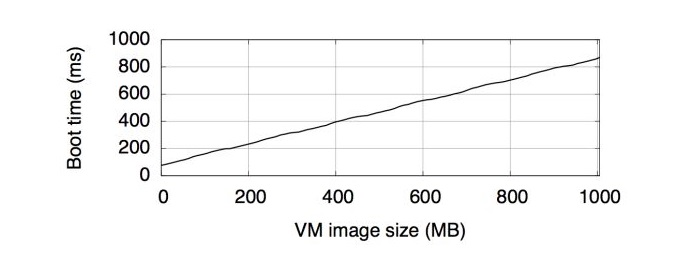
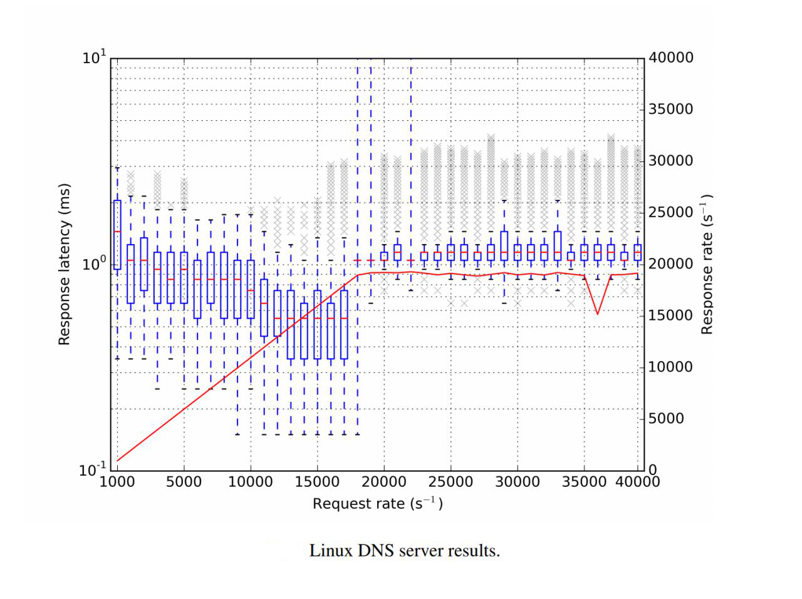
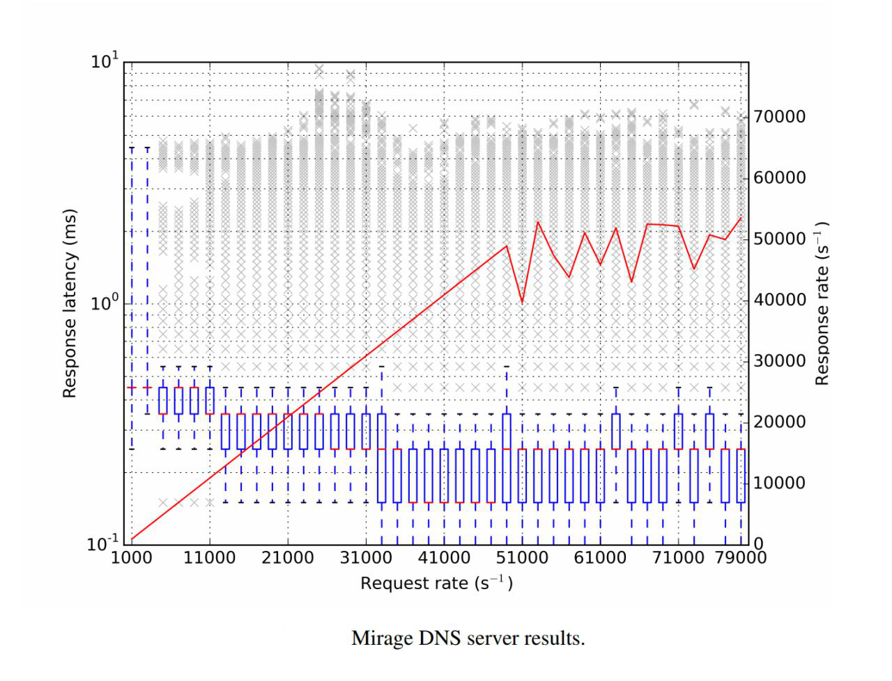
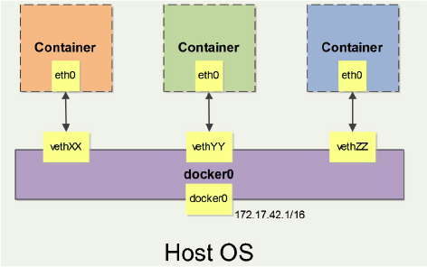

# 可行性报告

- [可行性报告](#)
  - [项目简介](#)
  - [项目背景](#)
    - [云服务的重要性](#)
    - [传统的虚拟化技术](#)
      - [简介](#)
      - [在云服务中的应用](#)
      - [特点](#)
    - [容器技术](#)
      - [简介](#)
      - [Docker](#docker)
      - [特点](#)
    - [Unikernel](#unikernel)
      - [Unikernel 相比 Traditional OS](#unikernel--traditional-os)
      - [Unikernel 相比 KVM](#unikernel--kvm)
      - [Unikernel 相比 Docker](#unikernel--docker)
    - [三种技术的对比](#)
  - [理论依据](#)
    - [Docker 发展迅速](#docker)
    - [Unikernel 的优势](#unikernel)
      - [启动速度比 Docker 更快](#docker)
      - [运行速度比 Docker 更快](#docker)
      - [内存开销比 Docker 更少](#docker)
  - [技术依据](#)
    - [现有的各种 Unikernel 实现](#unikernel)
      - [ClickOS](#clickos)
      - [Clive](#clive)
      - [Drawbridge](#drawbridge)
      - [HaLVM](#halvm)
      - [IncludeOS](#includeos)
      - [LING](#ling)
      - [MirageOS](#mirageos)
      - [OSv](#osv)
      - [Rumprun](#rumprun)
      - [runtime.js](#runtimejs)
      - [Unik](#unik)
    - [成功的统一化的例子：Docker 生态](#docker)
    - [Go 语言](#go)
      - [简介](#)
      - [Go 语言特点](#go)
      - [Go 语言优势](#go)
        - [性能强劲](#)
        - [部署简单](#)
        - [并发性好](#)
        - [编译速度快](#)
        - [语言交互性](#)
        - [静态语言，但拥有动态语言的一些特性](#)
        - [简单易学](#)
        - [强大的生态系统和丰富的标准库](#)
        - [完善的工具链](#)
      - [Go 语言适合的项目](#go)
      - [现有 Go 语言成功项目](#go)
    - [KVM](#kvm)
      - [简介](#)
      - [特点](#)
      - [选择 KVM 的原因](#kvm)
      - [使用示例](#)
    - [Docker 的网络管理](#docker)
    - [Docker 的数据卷](#docker)
  - [技术路线](#)
  - [基本概念](#)
  - [Q&A](#qa)
  - [参考资料及链接](#)

## 项目简介

Cunik 是一个面向开发人员和系统管理人员的平台，用于方便构建 Unikernel 应用、与其他必需内容一起打包、分发，从 CunikHub 轻松获取已构建好的镜像，快速部署和运行应用。


## 项目背景

### 云服务的重要性

云服务是基于的相关服务的、使用和交互模式，通常涉及通过互联网来提供动态易扩展且经常是虚拟化的资源。 云是网络、互联网的一种比喻说法。过去在图中往往用云来表示电信网，后来也用来表示互联网和底层基础设施的抽象。云服务指通过网络以按需、易扩展的方式获得所需服务。这种服务可以是IT和软件、互联网相关，也可是其他服务。它意味着计算能力也可作为一种商品通过互联网进行流通。

在这个时代，云服务的重要性日益凸显：

* 2017 年天猫双十一节，交易峰值达到 32.5 万次/秒，支付峰值达到 25.6 万次/秒，数据库处理峰值达到 4200 万次/秒。没有稳定高效的云服务，这是不可能实现的；
* 2017 年云服务提供商亚马逊的 AWS 目前占据了全球云计算市场 27% 份额，一共托管了 200 万台服务器，营收 40 亿美元，年增长率达到了惊人的 42%。


### 传统的虚拟化技术

#### 简介

虚拟化技术通过硬件与软件的支持在同一物理机器上提供逻辑上相互隔离的虚拟的设备，使得在同一台机器上同时运行多个操作系统成为可能。

#### 在云服务中的应用

虚拟化技术是云服务中最活跃的主体，也是核心之一，很多服务都是围绕着虚拟机提供服务。云服务提供商在他们的机器上运行虚拟机的管理程序，当有用户需要新的云服务时，为其创建新的虚拟机。对于用户而言，他们得到的是一台远程机器，具有完全的访问权限，安装或使用服务提供商提供的操作系统，就可以将自己的应用部署在该机器上。

#### 特点

这种传统的使用虚拟化技术提供云服务、在虚拟机上运行操作系统、在操作系统上运行应用程序的特点是：

* 隔离性和安全性高——这一点由虚拟化技术直接保障；
* 部署比较方便——用户面对的是常用的操作系统，使用常规的方法就可以完成应用的部署；
* 灵活性高——用户可以自己选择操作系统，并对其有完全的控制权限；
* 资源开销大——用户为了部署一个应用，需要购买能够运行一个操作系统的资源。


### 容器技术

#### 简介

不同于传统虚拟化技术提供逻辑上独立的硬件平台的方式，容器技术是对操作系统的虚拟化，容器在 Host 操作系统的用户空间中运行，与操作系统的其他进程相隔离。

Linux 操作系统提供了 namespace 技术和 cgroups 技术。前者是一种内核级别的环境隔离方法，使得对文件系统、IPC、PID、网络、用户等的隔离成为可能。后者是以组为单位对进程的资源使用进行控制的技术。二者结合，就可以实现对操作系统的虚拟化。

Docker 是在这一技术的基础上开发的极为成功的一款产品。

#### Docker 

Docker 是 dotCloud 公司开发的一款开源的应用容器引擎，集版本控制、克隆继承、环境隔离等特性于一身，提出一整套软件构建、部署和维护的解决方案，让开发者可以打包他们的应用及依赖环境到一个可移植的容器中，然后发布到任何运行有 Docker 引擎的机器上。

Docker 提供了轻量级的虚拟化，几乎没有任何额外的开销，且容器的启动和停止都能在几秒钟内完成。与传统虚拟化技术相比具有众多优势：

- 可大大提高系统资源的利用率；


- 可在秒级内启动操作系统，而不是像传统的虚拟机技术启动应用服务需要数分钟；
- 提供了一致的运行环境；
- 现有的技术可以轻松应用；
- 允许持续交付和部署，为开发和运维人员提供极大便利；
- 由于可以确保环境的一致性，因此可以轻松地迁移；
- 由于使用分层存储和镜像技术，可以更轻松地维护和扩展。

#### 特点

- 隔离性和安全性比较差——一旦一个容器应用出现安全问题，将影响到同一操作系统上运行的其他应用；
- 部署非常方便——使用 Docker 等容器引擎，可以实现应用的轻松分发、部署；
- 灵活性较高——容器可以迅速启动和停止，比传统的虚拟机技术快很多；
- 资源开销较小；
- 性能以传统的应用为上限——Docker 一般都要运行在精简 Linux 内核系统上，如 CoreOS，Google 的 Container optimized OS，运行速度仍然受限于 Linux 内核。


### Unikernel

既然不得不用虚拟机，工业界开始将目标转向虚拟机以及云服务专用操作系统的优化。早期的 Unikernel 是靠自动化内核裁剪工具裁剪 Linux 内核以达到占用资源更少的效果，但体积相比 Docker 容器还是过大，造成了巨大的资源浪费。经过了几年的技术积淀，就在不久之前的 2017 年，Unikernel 的发展出现了重大突破。计算机系统领域的风向标 SOSP'17 会议上面，一篇标题为《我的虚拟机比你的 Docker 更轻量（更安全）》的论文获得了非常大的关注。论文作者通过对虚拟机和运行镜像的极致优化，使得 Unikernel 在保持了原有的安全性、隔离性、易部署性的前提下，竟然还做到了在启动速度、运行速度、内存开销等方面全面胜过 Docker。这必将引起云服务的全面革命。

#### Unikernel 相比 Traditional OS

- Unikernel 和操作系统都可以运行于 Bare Metal Architecture
- Unikernel 代码量和复杂度小于操作系统
- Unikernel 可以便捷的锁核，特定 CPU 服务于特定应用，减少线程切换开销
- Unikernel 可自定义模块，选择性抛弃应用不需要的内核模块，例如软驱，USB 驱动等
- Unikernel 一旦打包完成，内核模块的独立升级比较困难

#### Unikernel 相比 KVM

- Unikernel 可以运行于 Hypervisor 或是 Bare Metal Architecture，KVM 运行于Hosted Architecture
- Unikernel 可以选择性的打包内核模块，KVM 虚拟出完整的操作系统
- Unikernel 可以在一台宿主机上运行上千个应用，而这是虚拟机所无法办到的
- Unikernel 与 KVM 具有类似级别的计算隔离性

#### Unikernel 相比 Docker

- 运行于 Hosted Architecture，Unikernel 相比于 Docker 具有更好的隔离性，安全性
- 运行于 Bare Metal Architecture，Unikernel 相比于 Docker 具有更快的启动时间，但目前缺少编排管理系统的支持
- Unikernel 可满足定制化内核的需求

Unikernel 与嵌入式操作系统非常相似，构建的镜像可以运行在虚拟化和物理环境（甚至可以运行在 FPGA 上）中。不过由于 Unikernel 在编译时需要指定特定的驱动程序，所以制作的镜像在物理环境中不具备通用性。虚拟化技术向上层提供了统一的硬件层，屏蔽了底层物理硬件的差异，Unikernel 主要还是应用在虚拟化环境中。


Unikernel 早在 2013 年以前就已经被提出，但一直没有大规模的推广开，主要是因为其相关技术还不够成熟，暂时不能投入生产环境。但是可以看出，Unikernel 具有提高安全性、隔离性、降低性能开销、减少资源占用和能耗、降低成本的巨大潜力，将来一定会被业界广泛采用。

综合考虑二者的优点，我们提出了 Cunik。

融合 Docker 将应用容器化的思想，Cunik 向用户隐藏繁琐的细节，使用户可以轻松地进行 Unikernel 应用的构建、分发和运维、轻松配置、快速上手，降低开发、部署和运行成本，并可以克服 Unikernel 开发难度高、分发部署困难、对系统管理人员要求高、对现有云计算架构改动大的缺点。

借助 Unikernel 的优势，Cunik 可以使用户方便地获得显著的性能提升、更高的安全性、更小的攻击面、更小的硬件资源占用。


### 三种技术的对比

将传统虚拟化技术、容器技术和 Unikernel 对比，可以发现三者在各方面具有如下特性：

| 特性     | 虚拟机          | 容器                      | Unikernel                 |
| -------- | --------------- | ------------------------- | ------------------------- |
| 性能效率 | 一般            | 好                        | 好                        |
| 隔离性   | 好              | 差                        | 好                        |
| 安全性   | 好              | 差                        | 好                        |
| 维护难度 | 难              | 易                        | 难                        |
| 集群编排 | 难              | 易                        | 难                        |
| 开发难度 | 易              | 易                        | 难                        |
| 空间占用 | 大，一般为数 GB | 较小，一般为数十、数百 MB | 小，一般为数百 KB 或数 MB |


## 理论依据

### Docker 发展迅速

- 2013 年 10 月，dotCloud 公司索性更名为 Docker 股份有限公司，工作的重心也从 PaaS 平台业务转向全面围绕 Docker 来开发；
- 2014 年 1 月，Docker公司宣布完成15,000万美元的融资，雅虎联合创始人杨致远也参与跟投；
- 2014年6月9日，Docker 发布了 V1.0 版，Google、IBM、RedHat、Rackspace 等公司的核心人物在 DockerCon 2014 大会上，纷纷表示支持并加入 Docker 的阵营；
- Google 对 Docker的支持力度非常大，不仅把 Imctfy 先进之处融入 Docker 中，还把自己的容器管理系统 (kubernetes) 也开源出来。2014 年 11 月 5 日，Google 发布支持 Docker 的产品  DockerGoogle Container Engine ；2014年11月13日，Amazon 发布支持 Docker 的产品 AWS Container Service；
- 所有的云计算大公司，如 Azure、Google 和亚马逊等都在支持 Docker 技术，这实际上使得 Docker 成为云计算领域的一个重要级成员，也让 Docker 成为云应用部署的事实上的标准；
- 2014 年 12 月，Docker 发布了 Docker  集群管理工具 Machine 和 Swarm，标志着 Docker 开始突破一个标准的容器框架，打造属于 Docker 自己的集群平台和生态圈；
- 2015 年 10 月，Docker 收购 Tutum，Tutum 本身已经实现对亚马逊网络服务（AWS）、Digital Ocean、微软的 Azure 等主流云服务商的良好支持。
- 2016 年 1 月，Docker  官方计划全面支持自身的 Alpine Linux，使用它构建的基础镜像最小只有 5 M；
- 2016  年 3 月，Docker 在 Github 所有项目中排第7位，在云平台管理领域排名第一，远远超 Openstack 项目；
- Docker 的官方镜像仓库 Docker Hub 中已有 100,000 以上的应用。


### Unikernel 的优势

#### 启动速度比 Docker 更快

和启动速度相关的最重要的一个因素就是镜像体积大小，启动时间和镜像体积基本呈线性关系（基本上就是把镜像装载到内存中所需的时间）。现代 Unikernel 核心驱动与应用程序是同时打包构建的，因此非常干净和轻量。一个大小为 480K 的 Unikernel image（足以运行一个 DNS 服务了），启动时间只需要 3ms。而 Docker 启动时间至少是 200ms。



#### 运行速度比 Docker 更快

Unikernel 的内存是单地址空间，不区分系统内核区域和应用服务区域，消除了运行时内核态与用户态切换的过程，因此 Unikernel 在运行速度速度上会有很大的优势。跑同样的 DNS 服务，MirageOS （Unikernel 的一种实现） 比 Linux 性能都要好很多。MirageOS 极限 Response rate 超过 Linux 两倍以上，延迟则在 Linux 一半以下。和 Docker 相比就更不用说了。





在高性能数据库应用上面 Unikernel 同样表现优异。下图是在相同的硬件和配置下，在 OSv （Unikernel 的一种实现）与 Ubuntu （通用 Linux 发行版的一种）上运行 Redis 数据库服务的性能对比。OSv 的性能达到了 Ubuntu 的两倍以上。


#### 内存开销比 Docker 更少

轻量的另外一个好处就是更少的内存占用。对于同样的应用，当运行 Docker 容器数到 3000 时宿主机已经无法再创建容器了，而 Unikernels 容器启动 8000 个以上都毫无压力，甚至连启动时间都几乎没有发生变化。


## 技术依据

### 现有的各种 Unikernel 实现

Unikernel 可以在不同的硬件平台上用不同的方法实现不同的应用程序，现在 Unikernel 正运行在世界各地的研究实验室、服务器机房以及各种低功耗设备上。下面列举了一些典型 [Unikernel 实现的项目](http://unikernel.org/projects)。

#### ClickOS

基于开源虚拟化的高性能虚拟化软件平台。ClickOS 的虚拟机很小（5MB），可以快速启动（20ms），延迟很小（45us）。

#### Clive

用 Go 语言编写的在分布式和云计算环境中工作的操作系统

#### Drawbridge

用于应用程序沙盒的新型虚拟化形式的研究原型，结合了两个核心技术：picoprocess 和 library OS。

#### HaLVM

Glasgow Haskell 编译器工具套件的一个端口，使开发人员能够编写可直接在 Xen 虚拟机管理程序上运行的高级、轻量 VMs。

#### IncludeOS

一个最小化、面向服务、可包含的面向云服务的 library OS。目前是一个在虚拟硬件上运行 C++ 代码的研究项目。

#### LING

一个基于 Erlang/OTP 并理解 .beam 文件的 Unikernel。开发人员可在 Erlang 中创建代码并将其部署为 LING Unikernel。LING 删除了大部分矢量文件，只使用了 三个外部库而没有使用 OpenSSL。

#### MirageOS

一个纯净的 library OS，用于构建跨各种云计算平台和移动平台的安全、高性能的网络应用程序的 Unikernel。目前，在 OCaml 生态系统中，有近 100 个 MirageOS 库和越来越多的兼容库。

#### OSv

专为 Cloudius Systems 的云虚拟机设计的新操作系统。能够在不到一秒的时间内启动。OSv 被设计为全面支持在任何 Hypervisor 之上执行单个应用程序，从而实现了卓越的性能、高速而轻松的管理。现已支持 C、JVM、Ruby 和 Node.js 应用程序堆栈。

#### Rumprun

一个可以将现有的为修改的 POSIX 软件作为 Unikernel 运行的软件堆栈。Rumprun 支持多种平台，包括裸机和 Hypervisor。

#### runtime.js

用于运行 JavaScript 的云的开源 library OS，可以与应用程序捆绑在一起并作为不可变的轻量级 VM 镜像进行部署。目前 KVM 是唯一支持的 Hypervisor。

#### Unik

简化 Unikernels 编译和排版的工具。与 Docker 构建和编排容器的方法类似，Unik将流行语言（C/C++、Golang、Java、Python、Node.js）自动编译成 Unikernels。Unik 将 Unikernel 作为虚拟机在 OpenStack、VirtualBox、QEMU、AWS、vSphere、ukvm 和 Xen 上部署。Unik 整合了 Rumprun、OSv、IncludeOS 和 MirageOS 项目的工作。


以上绝大多数的 Unikernel 的应用都支持主流的虚拟化技术，因此我们可以通过对虚拟技术的封装完成 Unikernel 的管理。


### 成功的统一化的例子：Docker 生态

Docker 的生态具有以下的突出优点：

* 一致的运行环境

  开发过程中一个常见的问题是环境一致性问题。由于开发环境、测试环境、生产环境不一致，导致有些 bug 并未在开发过程中被发现。而 Docker 的镜像提供了除内核外完整的运行时环境，确保了应用运行环境一致性，从而不会再出现 *「这段代码在我机器上没问题啊」* 这类问题。

* 持续交付和部署

  对开发和运维（DevOps）人员来说，最希望的就是一次创建或配置，可以在任意地方正常运行。

  使用 Docker 可以通过定制应用镜像来实现持续集成、持续交付、部署。开发人员可以通过 Dockerfile 来进行镜像构建，并结合 持续集成（Continuous Integration）系统进行集成测试，而运维人员则可以直接在生产环境中快速部署该镜像，甚至结合 持续部署（Continuous Delivery/Deployment）系统进行自动部署。

  而且使用 `Dockerfile` 使镜像构建透明化，不仅仅开发团队可以理解应用运行环境，也方便运维团队理解应用运行所需条件，帮助更好的生产环境中部署该镜像。

* 更轻松的迁移

  由于 Docker 确保了执行环境的一致性，使得应用的迁移更加容易。Docker 可以在很多平台上运行，无论是物理机、虚拟机、公有云、私有云，甚至是笔记本，其运行结果是一致的。因此用户可以很轻易的将在一个平台上运行的应用，迁移到另一个平台上，而不用担心运行环境的变化导致应用无法正常运行的情况。

* 更轻松的维护和扩展

  Docker 使用的分层存储以及镜像的技术，使得应用重复部分的复用更为容易，也使得应用的维护更新更加简单，基于基础镜像进一步扩展镜像也变得非常简单。此外，Docker 团队同各个开源项目团队一起维护了一大批高质量的 [官方镜像](https://store.docker.com/search?q=&source=verified&type=image)，既可以直接在生产环境使用，又可以作为基础进一步定制，大大的降低了应用服务的镜像制作成本。

通过学习和借鉴 Docker 取得这些优点的途径，我们的产品也可以具有类似甚至更突出的优点。


### Go 语言

#### 简介

Go 语言是 Google 开发的一种静态强类型、编译型、并发型，并具有垃圾回收功能的开源编程语言。

#### Go 语言特点

- 简洁、快速、安全
- 并行、有趣、开源
- 内存管理、数组安全、编译迅速

#### Go 语言优势

##### 性能强劲

Go 语言性能与 Java 或 C++ 相似，比 Python 要快 30 倍左右。

##### 部署简单

Go 语言可直接编译成机器码，编译后生成一个静态可执行文件，除了 glibc 外没有其他外部依赖。这让部署变得异常方便：目标机器上只需要一个基础的系统和必要的管理、监控工具，完全不需要操心应用所需的各种包、库的依赖关系，大大减轻了维护的负担。

##### 并发性好

Go 语言在语言层面支持并发，Goroutine 和 Channel 使得编写高并发的软件变得相当容易，很多情况下完全不需要考虑锁机制以及由此带来的各种问题。单个 Go 应用也能有效利用多个 CPU 核。

##### 编译速度快

相比于 Java 和 C++ 缓慢的编译速度，Go 语言的快速编译是一个主要的效率优势。当你在还记得代码应该做什么时，编译已经完成了。

##### 语言交互性

Go 语言与 C 语言有良好的交互性，在 Go 语言中可以直接包含 C 语言代码，利用现有的丰富的 C 语言库。

##### 静态语言，但拥有动态语言的一些特性

Go 语言是静态类型语言，可以在编译时检查出隐藏的大多数问题。同时 Go 语言内置 runtime，支持垃圾回收，拥有了动态语言的特性之一。

##### 简单易学

Go 语言语法特性简单，并且 Go 语言的作者拥有 C 语言的背景，对于有 C 语言基础的学习者而言学习曲线平坦，上手快。

##### 强大的生态系统和丰富的标准库

Go 语言的生态系统虽然稍逊与 Java、Python这样的语言，但是相比 Rust、Elixir 等语言却有很大的优势。Go 语言的标准库中有绝大多数常用的库，提升了开发效率。

##### 完善的工具链

Go 语言自带完善的工具链，大大提高了团队协作的一致性。例如 Gofmt 自动排版 Go 代码，很大程度上杜绝了不同人的代码风格不一致的问题。

#### Go 语言适合的项目

- 服务器编程
- 分布式系统、数据库代理器等
- 网络编程，如 Web 应用、API 应用
- 内存数据库
- 云平台

#### 现有 Go 语言成功项目

下面是一些知名的使用 Go 语言开发的成功项目：

- Docker
- Doozer
- groupcache
- Packer
- NSQ
- skynet


### KVM

理论上我们可以支持任何虚拟技术，技术实现上我们首先支持 KVM。

#### 简介

KVM（Kernel-based Virtual Machine）是 Linux 内核提供的虚拟化技术，使用 QEMU 作为管理工具，可以将内核直接充当 hypervisor 来使用。KVM 需要处理器本身支持虚拟化扩展，如 Intel VT 和 AMD-V 技术等。

KVM 使得 guest OS 的 CPU 指令不需要经过翻译，直接在硬件上执行，因此大大提高了运行速度。

运行中的 guest OS 与 Linux 内核以及真实硬件的关系如下图所示：


#### 特点

- 必须在支持虚拟化技术（Intel VT 或 AMD-V）的 x86 平台上运行；
- 执行效率很高，但图形能力较差；
- 适用于服务器；
- 相比于 VMWare，免费开放；
- 相比于 Xen，容易安装部署。

#### 选择 KVM 的原因

- 最大化 Unikernel 的性能优势；
- KVM 作为 Linux 内核的一部分，有更大的成为行业标准的潜力；
- 简单——直接由内核支持；
- 已经被 Red Hat 和 Canonical 选为它们的虚拟化平台。

#### 使用示例

KVM 使用 qemu 作为用户空间的接口，要启动虚拟机，只需要执行类似于如下命令：

```shell
qemu-system-x86_64 --enable-kvm -kernel unikernel.bin
```


### Docker 的网络管理

为了对不同 Cunik 应用的网络进行管理，我们首先需要了解 Docker 对这一问题的解决方案。

Docker 允许通过外部访问容器或容器互联的方式来提供网络服务。

Docker启动时，会自动在主机上创建一个 docker0 虚拟网桥，实际上是 Linux 的一个 bridge,可以理解为一个软件交换机，它会而挂载到它的网口之间进行转发。当创建一个 Docker 容器的时候，同理会创建一对 veth pair 接口（当数据包发送到一个接口时，另外一个接口也可以收到相同的数据包），这对接口一端在容器内，即 eth0；另一端在本地并被挂载到 docker0 网桥，名称以 veth 开头。示意图如下：



Docker 网络配置主要分为两部分：Docker demon 的网络配置和 libcontainer 的网络配置。Docker daemon 的网络指 daemon 启动时，在主机系统上所做的网络设置，可以被所有 Docker 容器所使用；libcontainer 的网络配置则针对具体的容器，是在使用 docker run 命令启动容器时根据传入的参数为容器做的网络配置工作。


### Docker 的数据卷

为了对不同 Cunik 应用的数据进行管理，我们首先需要了解一下 Docker 对这一问题的解决方案。

Docker 容器默认使用的 AUFS 文件系统的设计使得 Docker 可以提高镜像构建、存储和分发的效率，节省了时间和存储空间，然而也存在以下问题：

* 容器中的文件在宿主机上存在形式复杂，不能在宿主机上很方便地对容器中的文件进行访问；

- 多个容器之间的数据无法方便的共享；
- 当删除容器时，容器产生的数据将丢失。

于是，Docker 引入了数据卷（volume）机制（vfs 文件系统，不支持写时复制）

数据卷是存在于一个或多个容器中的特定的目录，可以提供以下特性：

- 数据卷可以在容器之间共享和重用；
- 对数据卷的修改会立马生效；
- 对数据卷的更新不会影响镜像；
- 数据卷是被设计用来持久化数据的，它的生命周期独立于容器，默认会一直存在，即使容器被删除。


## 技术路线

我们的愿景是实现用于构建、管理、配置、运行的工具套件以及镜像仓库的搭建技术和示例仓库，下图展示了对整个项目结构的分析：


我们计划第一步实现针对已有镜像的管理、配置和运行，然后进一步实现支持多种 Unikernel 实现的构建，最后提供镜像仓库的搭建技术和示例仓库。


## 基本概念

* 客户端（client）

  Cunik client 是一个泛称，用来向指定的 Cunik daemon 发起请求,执行相应的容器管理操作。它既可以是 Cunik 命令行工具，也可以是任何遵循了Cunik API 的客户端。

* 服务（daemon）

  Cunik daemon是 Cunik 最核心的后台进程，它负责响应来自 Cunik client 的请求，然后根据这些请求完成容器管理操作。该进程会在后台启动一个 API Server,负责接收由 Cunik client 发送的请求；接收到的请求将通过 Cunik daemon 内部的一个路由分发调度，再由具体的函数来执行请求。

* 镜像（image）

  Cunik 镜像就是一个只读的模板。例如：一个镜像可以包含一个已编译成功的 nginx unikernel 应用和一些元数据（metadata）。

  镜像可以用来创建 Cunik 容器。

  Cunik 提供了一个很简单的机制来创建镜像或者更新现有的镜像，用户甚至可以直接从其他人那里下载一个已经做好的镜像来直接使用。

* 容器（container）

  Cunik 利用容器来运行 Unikernel 应用。

  容器是从镜像创建的运行实例。它可以被启动、开始、停止、删除。每个容器都是相互隔离的、保证安全的平台，这一点由虚拟机来保障。


## Q&A

* What does a Cunik image contain?

  A Cunik image contains a specified Unikernel image. But configuration files are also needed to run an instance.

* What kinds of Unikernel implementations are supported?

  For now, we support all Unikernel implementations on KVM.

* What platforms does Cunik support?

  We can configure automatically and work on a platform which supports KVM technology.


## 参考资料及链接

- [云服务](https://baike.baidu.com/item/云服务)
- [虚拟化技术漫谈](https://www.ibm.com/developerworks/cn/linux/l-cn-vt/)
- [全面认识Docker_《循序渐进学Docker》](https://yq.aliyun.com/articles/89983)
- [八个Docker的真实应用场景](http://dockone.io/article/126)
- [为什么要使用 Go 语言？Go 语言的优势在哪里？](https://www.zhihu.com/question/21409296)
- [Go 语言、Docker 和新技术](https://coolshell.cn/articles/18190.html)
- [QEMU,KVM及QEMU-KVM介绍](https://www.jianshu.com/p/4e893b5bfe81)
- Anil, M. and David, J. S. (2014). *Unikernels: The Rise of the Virtual Library operating System*.
- Darren Rush (2014). *After Docker: Unikernels and Immutable Infrastructure*.
- Filipe Manco, Costin Lupu, Florian Schmidt, Jose Mendes, Simon
  Kuenzer, Sumit Sati, Kenichi Yasukata, Costin Raiciu, and Felipe
  Huici. 2017. My VM is Lighter (and Safer) than your Container.